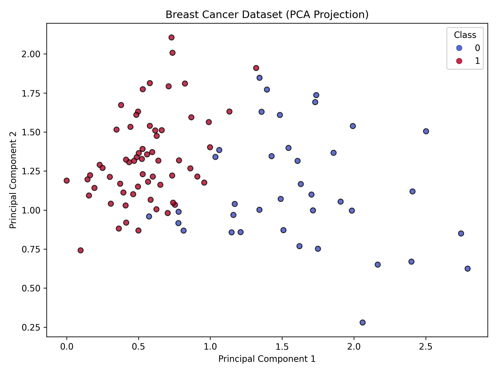
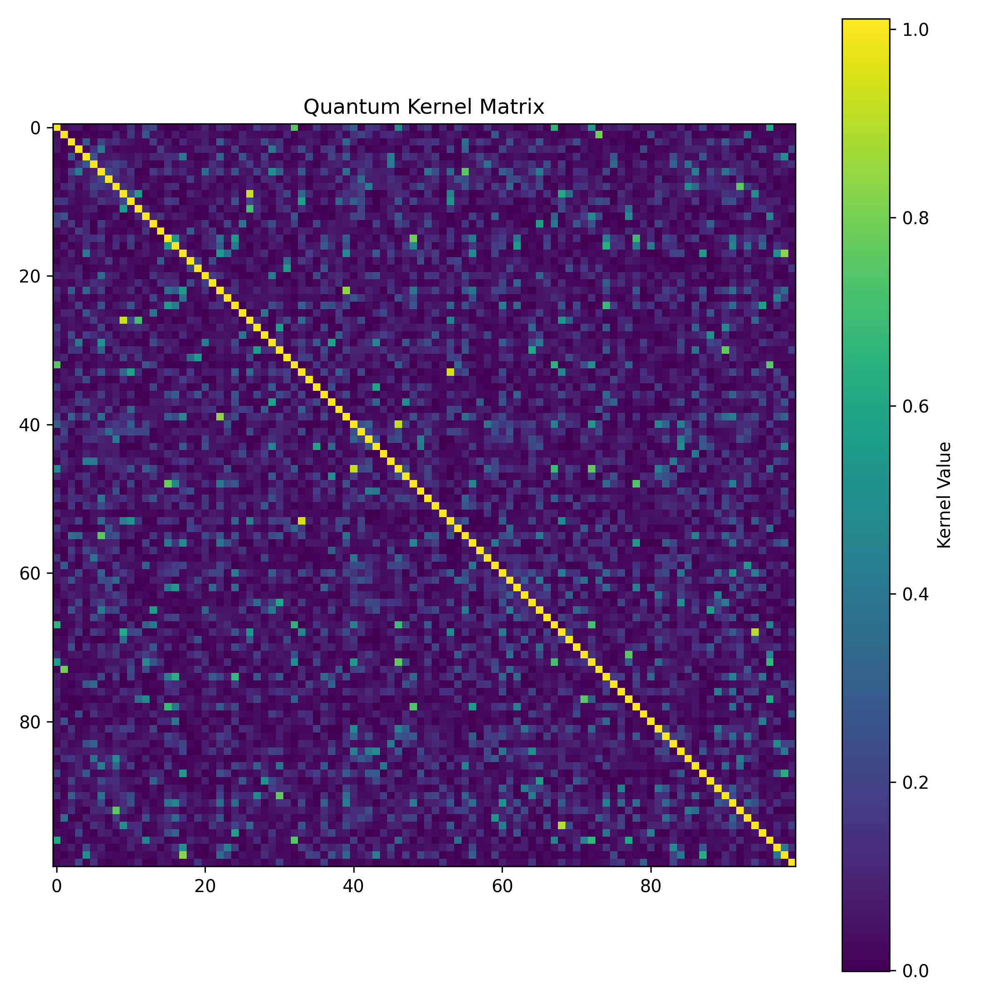
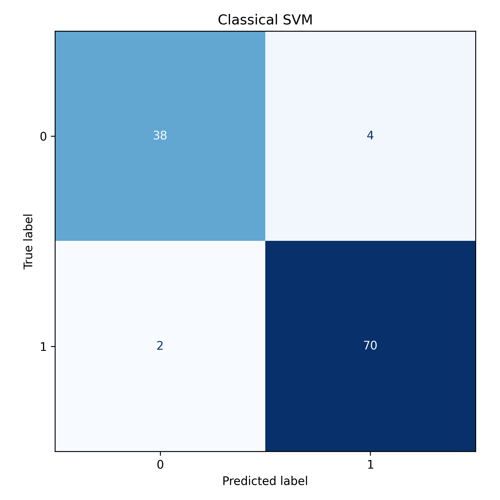
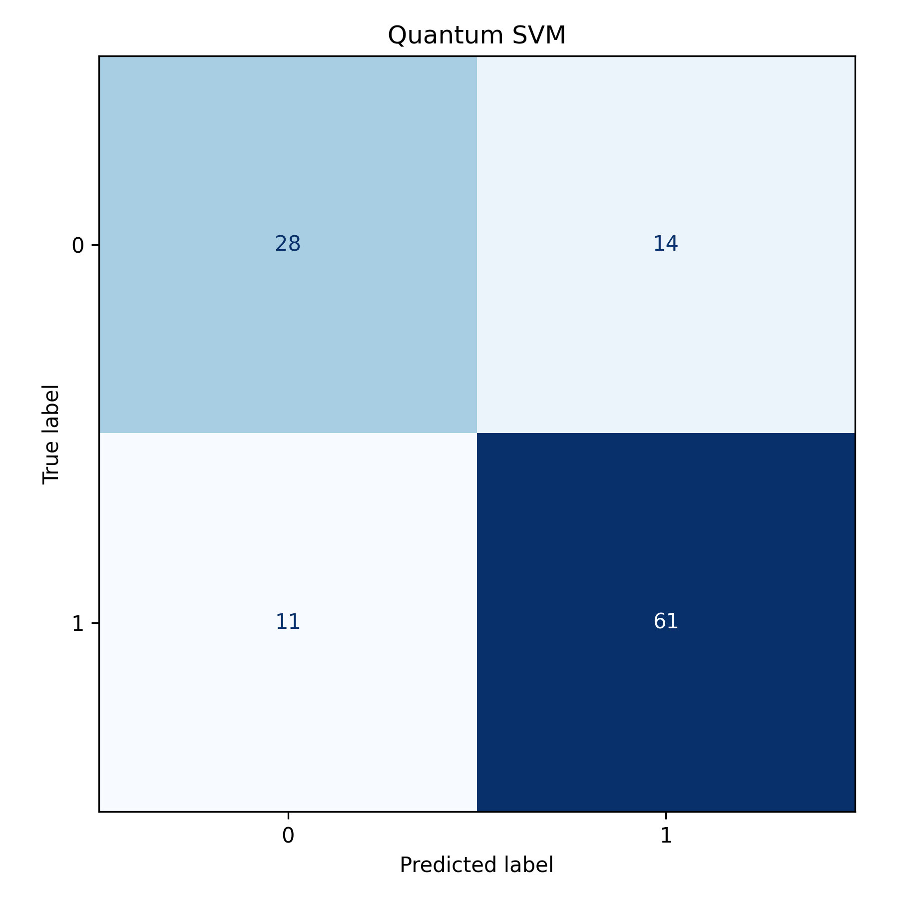
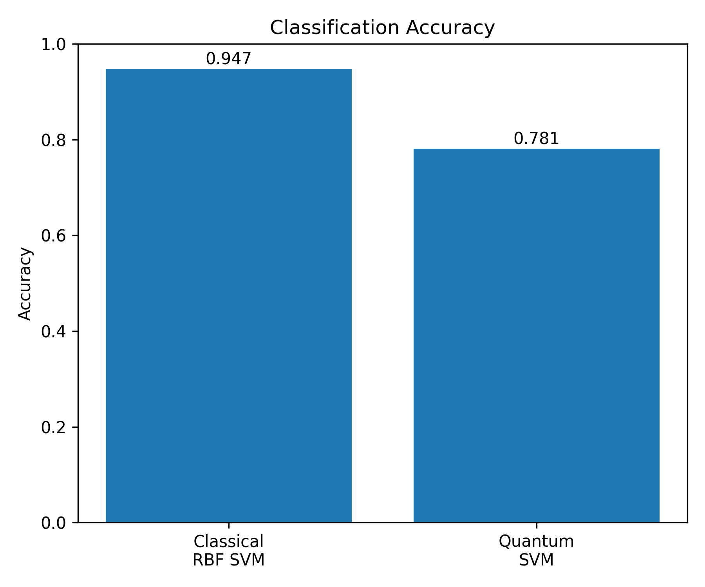

# Quantum Support Vector Machine (QSVM) using Qiskit

## Overview

This repository implements a **Quantum Support Vector Machine (QSVM)** using the latest **Qiskit Machine Learning** framework. Rather than relying on classical kernels such as the Radial Basis Function (RBF), this implementation constructs a **Fidelity Quantum Kernel**, allowing similarity between samples to be evaluated in a quantum feature space.

The objective of this project is to demonstrate a modern QSVM workflow using Qiskit while comparing its performance against a classical Support Vector Machine on a real-world binary classification task.

This repository is part of a larger collection of Quantum Machine Learning implementations intended to explore the capabilities and limitations of hybrid quantum-classical learning algorithms.

---

## Features

* Modern Qiskit implementation (no deprecated Aqua components)
* Fidelity Quantum Kernel using `FidelityQuantumKernel`
* `ZZFeatureMap` quantum data encoding
* Classical RBF SVM baseline
* Breast Cancer Wisconsin Dataset
* PCA-based dimensionality reduction
* Quantum kernel visualization
* Confusion matrices
* Dataset visualization
* Accuracy comparison plots

---

## Project Structure

```text
qsvm-qiskit/
│
├── data/
├── figures/
│   ├── accuracy_comparison.png
│   ├── confusion_classical.png
│   ├── confusion_quantum.png
│   ├── dataset.png
│   └── kernel_matrix.png
│
├── src/
│   ├── classical.py
│   ├── dataset.py
│   ├── quantum.py
│   └── visualization.py
│
├── train.py
├── requirements.txt
└── README.md
```

---

# Methodology

The complete pipeline follows the workflow below:

```text
Breast Cancer Dataset
            │
            ▼
      Standard Scaling
            │
            ▼
   Principal Component Analysis
            │
            ▼
 Feature Scaling to [0, π]
            │
            ▼
      ZZ Feature Map
            │
            ▼
 Fidelity Quantum Kernel
            │
            ▼
 Support Vector Machine
```

---

## Dataset

The model is trained on the **Breast Cancer Wisconsin Diagnostic Dataset**, a widely used binary classification benchmark consisting of diagnostic measurements computed from digitized breast mass images.

Each sample belongs to one of two classes:

* Benign
* Malignant

Since current quantum hardware and simulators have limited qubit capacity, the original 30-dimensional feature space is reduced to **4 principal components** using PCA, allowing each principal component to be encoded onto one qubit.

---

## Quantum Kernel

Unlike a conventional SVM that computes similarity directly in the original feature space, the QSVM first embeds classical data into a quantum Hilbert space using a **ZZ Feature Map**.

The similarity between two samples is then computed using the quantum state fidelity

[
K(x_i,x_j)=|\langle \phi(x_i)|\phi(x_j)\rangle|^2
]

where

* (x_i) and (x_j) are classical samples
* (\phi(x)) is the quantum feature map
* (K) is the quantum kernel matrix

The resulting kernel matrix is supplied to a classical Support Vector Machine for optimization.

---

# Results

## Dataset Projection

The original 30-dimensional dataset after PCA projection.

```markdown

```

---

## Quantum Kernel Matrix

Visualization of the Fidelity Quantum Kernel generated from the training samples.

```markdown

```

---

## Classical SVM Confusion Matrix

```markdown

```

---

## Quantum SVM Confusion Matrix

```markdown

```

---

## Accuracy Comparison

```markdown

```

---

# Performance

| Model             | Accuracy                |
| ----------------- | ----------------------- |
| Classical RBF SVM | **94.74%** |
| Quantum SVM       | **78%**                 |

Although the quantum model does not outperform the classical baseline, this outcome is expected given the current limitations of quantum machine learning. The QSVM operates with only four encoded features and a shallow parameterized feature map, making it an excellent demonstration of hybrid quantum-classical learning rather than a replacement for mature classical algorithms.

---

# Installation

Clone the repository

```bash
git clone https://github.com/<your-username>/qsvm-qiskit.git
cd qsvm-qiskit
```

Create a virtual environment

```bash
python -m venv .venv
```

Activate it

**Windows**

```bash
.venv\Scripts\activate
```

**Linux / macOS**

```bash
source .venv/bin/activate
```

Install the required packages

```bash
pip install -r requirements.txt
```

---

# Running the Project

```bash
python train.py
```

The script automatically

* loads the dataset
* preprocesses the data
* trains both classical and quantum SVMs
* evaluates performance
* generates all visualizations inside the `figures/` directory

---

# Technologies Used

* Python
* Qiskit
* Qiskit Machine Learning
* Scikit-learn
* NumPy
* Matplotlib
* Pandas

---

# Future Improvements

* Comparison of different quantum feature maps
* Noise-aware simulations
* Hardware execution on IBM Quantum devices
* Hyperparameter optimization
* Larger quantum feature spaces
* Alternative quantum kernels
* Multi-class QSVM implementations

---

# References

1. Havlíček et al., *Supervised learning with quantum-enhanced feature spaces*, Nature (2019).

2. Qiskit Machine Learning Documentation

3. Scikit-learn Documentation
